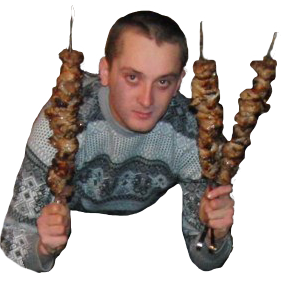

# newsuperman.github.io
<head> 
<meta charset="UTF-8"> 
<title>Biography</title> 
</head> 
<body> 
<h1></h1> 
<h2>Почему я хочу стать "айтишником"?</h2> 
<ul> 
<li>Хорошо оплачиваемая работа</li> 
<li>Перспектива работы зв рубежом</li> 
<li>Возможность попутешествовать по миру</li> 
<li>И просто отличная профессия</li>  
</ul> 
<h3>О себе</h3> 

Я, Шарапов Александр Сергеевич, мне 19 лет и я студент группы РК-31 университета ХНАДУ факультета Компьютерных технологий и мехатроники.
 
</body> 
</html>
